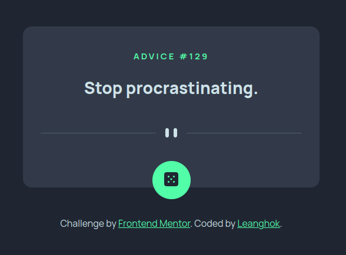

# Frontend Mentor - Advice Generator App Solution

This is a solution to the [Advice Generator App challenge on Frontend Mentor](https://www.frontendmentor.io/challenges/advice-generator-app-QdUG-13db). Frontend Mentor challenges help you improve your coding skills by building realistic projects.

## Table of contents

- [Overview](#overview)
  - [The challenge](#the-challenge)
  - [Screenshot](#screenshot)
  - [Links](#links)
- [My process](#my-process)
  - [Built with](#built-with)
  - [What I learned](#what-i-learned)
- [Author](#author)

## Overview

### The challenge

Users should be able to:

- View the optimal layout for the site depending on their device's screen size
- See hover states for all interactive elements on the page
- Generate a new piece of advice by clicking the dice icon

### Screenshot

### Links

- Solution URL: [Solution](https://www.frontendmentor.io/solutions/responsive-design-using-flexbox-html-css-and-js-C8V8mlFG2U)
- Live Site URL: [Live Site](https://advice-fm-gen.netlify.app/)

## My process

### Built with

- Semantic HTML5 markup
- CSS custom properties
- Flexbox

### What I learned

I learned quite alot from this one project, so here's a recap of I've learned:

- Transitions
- Working with API
- Media queries

## Author

- Website - [Leanghok](https://socials-link.netlify.app/)
- Frontend Mentor - [@leanghok120](https://www.frontendmentor.io/profile/leanghok120)
